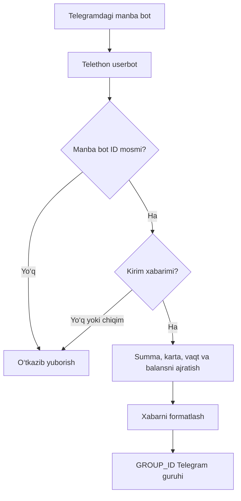

<div align="center">

# 💳 CardXabar

### Telegram karta kirimlarini avtomatik kuzatish va guruhga yuborish uchun Python userbot

[](https://www.python.org/)
[](https://docs.telethon.dev/)
[](https://telegram.org/)
[](#litsenziya-va-foydalanish)

**Kirim xabarlarini ajratadi · Ma’lumotlarni formatlaydi · Belgilangan Telegram guruhiga yuboradi**

</div>

---

## 📌 Loyiha haqida

**CardXabar** — Telegram akkaunt orqali ishlovchi, karta tranzaksiyalari haqidagi xabarlarni kuzatish uchun yozilgan **Python/Telethon userbot**. Dastur oldindan belgilangan Telegram botidan kelgan yangi xabarlarni tekshiradi, **kirim** belgilariga moslarini ajratadi va natijani belgilangan guruhga qulay ko‘rinishda jo‘natadi.

**Kimlar uchun?** Telegram orqali karta kirimlari haqida xabarnoma oladigan va ularni jamoa bilan bitta guruhda ko‘rishni istaydigan kichik savdo jamoalari yoki operatorlar uchun.

> [!IMPORTANT]
> CardXabar **rasmiy bank integratsiyasi yoki to‘lovni tasdiqlash tizimi emas**. U faqat Telegram’da kelgan xabarlarni qayta ishlaydi. To‘lovni yakuniy tasdiqlash uchun bank yoki to‘lov provayderining rasmiy ma’lumotlarini tekshiring.

## 📚 Mundarija

- [Asosiy imkoniyatlar](#-asosiy-imkoniyatlar)
- [Texnologiyalar](#-texnologiyalar)
- [Ishlash jarayoni](#-ishlash-jarayoni)
- [Loyiha tuzilishi](#-loyiha-tuzilishi)
- [Talablar](#-talablar)
- [O‘rnatish](#-ornatish)
- [Konfiguratsiya](#-konfiguratsiya)
- [Telegram akkauntga kirish](#-telegram-akkauntga-kirish)
- [Userbotni ishga tushirish](#-userbotni-ishga-tushirish)
- [Buyruqlar va test](#-buyruqlar-va-test)
- [Xabarlarni aniqlash logikasi](#-xabarlarni-aniqlash-logikasi)
- [Serverda ishga tushirish](#-serverda-ishga-tushirish)
- [Xavfsizlik va maxfiylik](#-xavfsizlik-va-maxfiylik)
- [Muammolar va yechimlar](#-muammolar-va-yechimlar)
- [Litsenziya va foydalanish](#-litsenziya-va-foydalanish)
- [Ishlab chiquvchilar va aloqa](#-ishlab-chiquvchilar-va-aloqa)

---

## ✨ Asosiy imkoniyatlar

| Imkoniyat | Tavsif |
|---|---|
| **Telegram userbot** | Oddiy Telegram akkaunti nomidan ishlaydi (BotFather bot tokeni emas). |
| **Manba monitoringi** | `SOURCE_BOT_ID` ga mos yangi xabarlarni kuzatadi. |
| **Kirim filtri** | `🟢` yoki `➕` kabi belgilar orqali kirim xabarlarini ajratadi. |
| **Chiqim filtri** | `🔴` yoki `➖` bilan belgilangan chiqim xabarlarini jo‘natmaydi. |
| **Ma’lumotlarni ajratish** | Summa, karta raqami qismi, manba/izoh, vaqt va balansni matndan oladi. |
| **Chiroyli format** | Kirim ma’lumotlarini guruhda o‘qish uchun qulaylashtiradi. |
| **Media qo‘llab-quvvatlash** | Media mavjud bo‘lgan xabarlarda faylni izoh (caption) bilan uzatadi. |
| **Tezkor test** | `/test` va `test_message.py` orqali sinov xabarlaridan foydalanish mumkin. |
| **Ajratuvchi xabar** | `/line` buyrug‘i yordamida guruhga vizual ajratuvchi yuboradi. |

## 🧰 Texnologiyalar

| Texnologiya | Vazifasi |
|---|---|
| **Python 3.10+** | Asosiy dasturlash tili |
| **Telethon** | Telegram MTProto klienti va xabar eventlari |
| **python-dotenv** | Lokal `.env` konfiguratsiyasini o‘qish |
| **Telegram API** | Telegram akkauntga ulanish, xabarlarni qabul qilish va yuborish |

## 🔄 Ishlash jarayoni



> [!NOTE]
> Diagramma loyiha tavsifidagi mantiqiy oqimni ko‘rsatadi. Filtrlash va maydonlarni ajratishning aniq implementatsiyasi `userbot.py` ichida joylashgan.

## 🗂️ Loyiha tuzilishi

```text
CardXabar/
├── userbot.py                 # Xabarlarni kuzatish, filtrlash va guruhga yuborish
├── login.py                   # Telegram akkauntga kirish va sessiya yaratish
├── test_message.py            # Test xabarlarini yuboruvchi yordamchi skript
├── .env                       # Lokal maxfiy konfiguratsiya (GitHubga yuklanmaydi)
├── .gitignore                 # Gitga kiritilmaydigan fayllar ro‘yxati
└── userbot_session.session    # Login davomida yaratiladigan maxfiy sessiya fayli
```

**Eslatma:** `.env` va `*.session` fayllari loyihaning kod qismi emas; ular har bir ish muhiti uchun alohida yaratiladi. `requirements.txt` hamda `.env.example` ni repozitoriyga qo‘shish tavsiya etiladi (ular mavjudligi tasdiqlanmagan).

## ✅ Talablar

- Python **3.10 yoki undan yuqori**;
- Telegram akkaunt (kuzatiladigan botdan xabar qabul qilishi kerak);
- Telegram API uchun `API_ID` va `API_HASH`;
- Xabar yuboriladigan guruhning `GROUP_ID` qiymati;
- Internetga barqaror ulanish;
- Telegram guruhida xabar yuborish huquqi.

Telegram API ma’lumotlari: **[my.telegram.org](https://my.telegram.org/)** → **API development tools**. `API_ID` va `API_HASH` ni maxfiy saqlang.

## 🚀 O‘rnatish

### 1. Loyiha papkasiga o‘tish

Agar kod lokal kompyuteringizda mavjud bo‘lsa, terminalni loyiha ildizida oching:

```bash
cd CardXabar
```

Agar GitHub’dan olayotgan bo‘lsangiz, quyidagini o‘zingizning haqiqiy repozitoriy URL manzilingiz bilan almashtiring:

```bash
git clone https://github.com/ismoillooff/Card-Xabar.git
cd CardXabar
```

### 2. Virtual muhit yaratish

**Windows / Linux / macOS:**

```bash
python -m venv venv
```

### 3. Virtual muhitni faollashtirish

**Windows PowerShell:**

```powershell
.\venv\Scripts\Activate.ps1
```

**Windows CMD:**

```cmd
venv\Scripts\activate.bat
```

**Linux / macOS:**

```bash
source venv/bin/activate
```

Agar PowerShell skriptni bloklasa, shu terminal sessiyasi uchun quyidagi buyruqni ishlatish mumkin:

```powershell
Set-ExecutionPolicy -Scope Process -ExecutionPolicy Bypass
.\venv\Scripts\Activate.ps1
```

### 4. Kutubxonalarni o‘rnatish

```bash
python -m pip install --upgrade pip
python -m pip install telethon python-dotenv
```

Agar `requirements.txt` yaratmoqchi bo‘lsangiz, minimal namunasi:

```text
telethon
python-dotenv
```

So‘ng:

```bash
python -m pip install -r requirements.txt
```

> Aniq versiyalar kod bilan sinovdan o‘tkazilgandan keyin `requirements.txt` ga mahkamlanishi (pin) tavsiya etiladi. Ushbu hujjatda tasdiqlanmagan versiyalar keltirilmagan.

## ⚙️ Konfiguratsiya

Loyiha ildizida `.env` faylini yarating:

```dotenv
API_ID=123456
API_HASH=your_api_hash
PHONE_NUMBER=+998901234567
GROUP_ID=-1001234567890
```

| Kalit | Nima uchun kerak? | Namuna |
|---|---|---|
| `API_ID` | Telegram API ilovangiz identifikatori | `123456` |
| `API_HASH` | Telegram API maxfiy kaliti | `your_api_hash` |
| `PHONE_NUMBER` | Userbot ishlaydigan akkaunt telefoni | `+998901234567` |
| `GROUP_ID` | Natija yuboriladigan Telegram guruh ID si | `-1001234567890` |

**Manba bot ID:** dastlabki tavsifga ko‘ra `userbot.py` ichida quyidagicha ko‘rsatilgan:

```python
SOURCE_BOT_ID = 915326936
```

Boshqa manba botga o‘tish kerak bo‘lsa, haqiqiy koddagi ushbu qiymatni tekshirib yangilang. `SOURCE_BOT_ID` `.env` orqali boshqarilishi hozircha ko‘rsatilmagan — u avtomatik ravishda `.env` dan o‘qiladi deb hisoblamang.

> [!CAUTION]
> Yuqoridagi qiymatlar **namuna**. `.env` faylini yoki haqiqiy API ma’lumotlarini GitHub, chat yoki ochiq loglarga joylamang.

## 🔑 Telegram akkauntga kirish

Birinchi ishga tushirishdan oldin:

```bash
python login.py
```

Skript Telegram tasdiqlash kodini so‘rashi mumkin. Agar ikki bosqichli himoya (2FA) yoqilgan bo‘lsa, Telegram paroli ham kerak bo‘ladi.

Muvaffaqiyatli login natijasida `userbot_session.session` fayli yaratiladi. Unda akkaunt sessiyasi saqlanadi; **bu faylga ega bo‘lgan begona shaxs akkauntga kirish imkoniyatini qo‘lga kiritishi mumkin**.

## ▶️ Userbotni ishga tushirish

```bash
python userbot.py
```

Dastur ishga tushgach, manba botdan kelayotgan mos kirim xabarlarini kuzatadi va maqsadli guruhga yuboradi. Berilgan tavsifga ko‘ra konsolda akkaunt, manba va guruhga oid ishga tushish ma’lumotlari ko‘rsatiladi.

**Tezkor ishga tushirish (Windows PowerShell):**

```powershell
python -m venv venv
.\venv\Scripts\Activate.ps1
python -m pip install telethon python-dotenv
python login.py
python userbot.py
```

**Tezkor ishga tushirish (Linux / macOS):**

```bash
python3 -m venv venv
source venv/bin/activate
python -m pip install telethon python-dotenv
python login.py
python userbot.py
```

> `login.py` odatda faqat birinchi marta yoki sessiya qayta tasdiqlanishi kerak bo‘lganda ishlatiladi.

## ⌨️ Buyruqlar va test

Buyruqlar userbot ishlayotgan Telegram akkaunti tomonidan yuborilganda bajarilishi tavsiflangan.

| Buyruq | Natija |
|---|---|
| `/test` | `GROUP_ID` guruhiga formatlangan test kirim xabarini yuboradi |
| `/line` | `GROUP_ID` guruhiga ajratuvchi chiziq yuboradi |

### Test skripti

```bash
python test_message.py
```

| Tanlov | Vazifasi |
|---|---|
| `1` | Kirim namunasini o‘zingizga yuboradi |
| `2` | Chiqim namunasini o‘zingizga yuboradi |
| `3` | Ikkala namunani ham yuboradi |

> [!IMPORTANT]
> `test_message.py` orqali o‘zingizga yuborilgan xabarlar **manba botdan kelmagan** bo‘lishi mumkin. Shuning uchun bu test xabar formatini tekshiradi, lekin `SOURCE_BOT_ID` filtridan o‘tadigan to‘liq end-to-end sinov o‘rnini bosmasligi mumkin. Manba bot bilan ishlashni alohida tekshiring.

## 🧠 Xabarlarni aniqlash logikasi

### Belgilar

| Xabar turi | Belgilar | Amal |
|---|---|---|
| **Kirim** | `🟢`, `➕` | Mos xabarni qayta ishlash |
| **Chiqim** | `🔴`, `➖` | Xabarni o‘tkazib yuborish |

Kirimga oid maydonlar:

- **Summa** — kelib tushgan pul miqdori;
- **Karta** — matnda mavjud karta identifikatori yoki oxirgi raqamlari;
- **Manba / izoh** — xabardagi ko‘rsatilgan ma’lumot;
- **Vaqt** — tranzaksiya xabarida berilgan vaqt;
- **Balans** — xabarda mavjud balans.

**Muhim cheklov:** oddiy emoji filtri bank/bot xabar formati o‘zgarsa, xato ishlashi mumkin. Bir xabarda bir nechta belgi bo‘lsa yoki kerakli maydonlar yetishmasa, real kodning ustuvorlik va fallback qoidalarini tekshirish kerak. Ushbu README’da tasdiqlanmagan regex yoki xabar namunasi haqiqiy implementatsiya deb ko‘rsatilmaydi.

### Media xabarlar

Agar manba xabarda media bo‘lsa, loyiha tavsifiga ko‘ra media formatlangan caption bilan yuboriladi. Matn va media jo‘natish yo‘llarini bir-biridan alohida test qilish tavsiya etiladi.

## 🖥️ Serverda ishga tushirish

Userbot terminal yopilgandan keyin ham ishlashi kerak bo‘lsa, Linux VPS’da `systemd` xizmatidan foydalanish mumkin. **Quyidagi konfiguratsiya — deployment namunasi, repozitoriyda tayyor service fayli borligi tasdiqlanmagan.**

### 1. Serverda loyihani tayyorlash

Loyihani masalan `/opt/cardxabar` papkasiga joylang, virtual muhit yarating, kutubxonalarni o‘rnating va `.env` ni xavfsiz sozlang. Avval interaktiv terminalda `python login.py` orqali sessiya yarating.

### 2. `systemd` service namunasi

`/etc/systemd/system/cardxabar.service`:

```ini
[Unit]
Description=CardXabar Telegram Userbot
Wants=network-online.target
After=network-online.target

[Service]
Type=simple
User=cardxabar
WorkingDirectory=/opt/cardxabar
ExecStart=/opt/cardxabar/venv/bin/python /opt/cardxabar/userbot.py
Restart=on-failure
RestartSec=10

[Install]
WantedBy=multi-user.target
```

`cardxabar` foydalanuvchisi mavjud bo‘lishi, loyiha va sessiya fayliga yetarli ruxsatga ega bo‘lishi kerak. Loginni shu ishchi foydalanuvchi nomidan bajarish yoki sessiya fayli joylashuvini tekshirish muhim. Servis ishga tushishdan oldin `.env` ham shu foydalanuvchiga o‘qiladigan bo‘lishi kerak.

### 3. Xizmatni ishga tushirish

```bash
sudo systemctl daemon-reload
sudo systemctl enable --now cardxabar
sudo systemctl status cardxabar
```

Loglarni ko‘rish:

```bash
sudo journalctl -u cardxabar -n 100 --no-pager
sudo journalctl -u cardxabar -f
```

Qayta ishga tushirish:

```bash
sudo systemctl restart cardxabar
```

> [!WARNING]
> **Bitta Telegram sessiyasini bir vaqtning o‘zida bir nechta jarayonda ishga tushirmang.** Bu sessiya bazasi bloklanishi yoki ulanish ziddiyatlariga olib kelishi mumkin. Lokal ishga tushgan jarayonni to‘xtatib, keyin server xizmatini yoqing.

## 🔐 Xavfsizlik va maxfiylik

### `.gitignore` namunasi

```gitignore
# Secrets
.env
.env.*
!.env.example

# Telegram session
*.session
*.session-journal

# Virtual environments
venv/
.venv/

# Python cache and tooling
__pycache__/
*.py[cod]
.pytest_cache/
.mypy_cache/
.ruff_cache/

# Logs
*.log
logs/

# Editors / operating systems
.vscode/
.idea/
.DS_Store
Thumbs.db
```

**Xavfsizlik bo‘yicha tavsiyalar:**

1. `API_ID`, `API_HASH`, telefon va sessiya ma’lumotlarini ommaviy repozitoriyga joylamang.
2. `*.session` fayllarini backup va log tizimlarida ham maxfiy saqlang; kirishni cheklang.
3. Agar sessiya oshkor bo‘lsa, Telegram’ning **Settings → Devices** bo‘limida tegishli sessiyani bekor qiling va qayta autentifikatsiya qiling.
4. API credential oshkor bo‘lsa, Telegram developer sozlamalarida mavjud tiklash/yangilash imkoniyatlarini tekshiring; sessiya bekor qilinishi va yangi API ma’lumotlari zarur bo‘lishi mumkin.
5. Guruhdagi moliyaviy ma’lumotlarni faqat vakolatli xodimlarga oching; karta va mijoz ma’lumotlarini ortiqcha tarqatmang.
6. Kirim xabarini soxta ma’lumot bilan almashtirish ehtimolini hisobga oling: SMS/Telegram xabari real bank tasdig‘i o‘rniga o‘tmaydi.
7. Telegram avtomatlashtirishida platforma qoidalari va cheklovlariga rioya qiling.

### Maxfiy fayl avval Gitga qo‘shilgan bo‘lsa

`.gitignore` **oldin commit qilingan faylni Git tarixidan o‘chirmaydi**. Faylni faqat joriy kuzatuvdan chiqarish uchun:

```bash
git rm --cached .env
git rm --cached userbot_session.session
git commit -m "Stop tracking local secrets"
```

Bu buyruqlar fayl mavjud va Git tomonidan kuzatilgan holat uchungina mos; Git tarixidagi eski nusxalar saqlanib qoladi. Credential yoki session sizib chiqqan bo‘lsa, ularni bekor qilish/yangilash va tarixni alohida xavfsiz tozalash talab etiladi.

## 🛠️ Muammolar va yechimlar

| Muammo | Ehtimoliy sabab | Tekshiruv |
|---|---|---|
| `API_ID` noto‘g‘ri | Son o‘rniga boshqa qiymat yoki `.env` yuklanmagan | `.env` formatini va kodning `load_dotenv()` chaqiruvini tekshiring |
| Telegram login qayta so‘raladi | Sessiya fayli topilmagan, bekor bo‘lgan yoki boshqa katalogda | `userbot_session.session` joylashuvi va ishchi katalogni tekshiring |
| Xabar guruhga bormaydi | `GROUP_ID` noto‘g‘ri yoki akkauntda ruxsat yo‘q | Guruh ID, a’zolik va xabar yuborish ruxsatlarini tekshiring |
| Kirim xabari o‘tkazib yuboriladi | Yuboruvchi ID yoki kirim belgisi mos emas | `SOURCE_BOT_ID` va kelgan xabar formatini tekshiring |
| Media yuborilmaydi | Media turi yoki Telegram cheklovi | Media bor alohida test xabar bilan tekshiring |
| `database is locked` | Bitta `.session` faylidan ikki jarayon foydalanmoqda | Ikkinchi jarayonni to‘xtating |
| `ModuleNotFoundError` | Virtual muhit yoqilmagan yoki paketlar o‘rnatilmagan | `python -m pip install telethon python-dotenv` |
| Serverda ishlaydi, lekin sessiya yo‘q | `systemd` boshqa foydalanuvchi/katalogda ishlaydi | `User`, `WorkingDirectory`, faylga ruxsat va session yo‘lini tekshiring |

### Diagnostika buyruqlari

Python versiyasi:

```bash
python --version
```

Paketlar:

```bash
python -m pip show telethon python-dotenv
```

Linux service holati:

```bash
sudo systemctl status cardxabar
sudo journalctl -u cardxabar -n 100 --no-pager
```

### Ishlayotganini tekshirish ro‘yxati

- [ ] `.env` qiymatlari to‘g‘ri kiritilgan
- [ ] `python login.py` muvaffaqiyatli tugagan
- [ ] Sessiya fayli yaratilgan va maxfiy saqlangan
- [ ] `python userbot.py` xatosiz ishga tushgan
- [ ] Userbot akkaunti maqsadli guruhda mavjud
- [ ] `/test` xabari maqsadli guruhga borgan
- [ ] Haqiqiy manba bot kirim xabari uzatilgan
- [ ] Chiqim xabari guruhga uzatilmagan
- [ ] Media bor kirim xabari ham tekshirilgan

## 📈 Keyingi rivojlantirish g‘oyalari

Quyidagilar **joriy kodda bor deb da’vo qilinmaydi**, ammo keyingi versiyalarda foydali bo‘lishi mumkin:

- `SOURCE_BOT_ID` ni `.env` yoki konfiguratsiya orqali o‘zgartirish;
- Xabar formatini regex va test namunalari bilan yanada ishonchli ajratish;
- Dublikat xabarlarni aniqlash;
- Tuzilmali logging va xatolar haqida admin xabarnomasi;
- Guruhlar va ruxsatlarni kengaytirilgan boshqarish;
- Ma’lumotlarni saqlash muddatlari va maxfiylik siyosatini belgilash.

## 📄 Litsenziya va foydalanish

CardXabar — maxsus ishlab chiqilgan loyiha. **Ochiq manba litsenziyasi foydalanuvchi taqdim etgan ma’lumotlarda ko‘rsatilmagan.** Shuning uchun repozitoriyning public bo‘lishi koddan cheklanmagan foydalanish, uni o‘zgartirish yoki tijoriy qayta tarqatishga avtomatik ruxsat bermaydi. Foydalanish huquqi bo‘yicha savollarni ishlab chiquvchiga yo‘llang.

## 👨‍💻 Ishlab chiquvchilar va aloqa

Loyiha **[MyWeb](https://myweb.uz)** va **[Nyrosoft](https://nyrosoft.uz)** tomonidan ishlab chiqilgan.

Agar kodni o‘rnatish, sozlash, moslashtirish, mavjud xatolarni hal qilish yoki qo‘shimcha funksiyalar bo‘yicha savollar va tushunmovchiliklar yuzaga kelsa, dasturchi bilan bog‘laning.

| Aloqa turi | Ma’lumot |
|---|---|
| **Dasturchi** | **Hayotbek Ismoilov** |
| **Telefon / WhatsApp** | [+998 95 005 15 45](tel:+998950051545) |
| **Telegram** | [@ismoillooff](https://t.me/ismoillooff) |
| **Instagram** | [@ismoillooff](https://instagram.com/ismoillooff) |
| **Web** | [myweb.uz](https://myweb.uz) · [nyrosoft.uz](https://nyrosoft.uz) |

---

<div align="center">

**CardXabar — kirim xabarlarini tartibli kuzatish uchun sodda Telegram avtomatlashtirish yechimi.**

Developed by **MyWeb × Nyrosoft**

</div>
